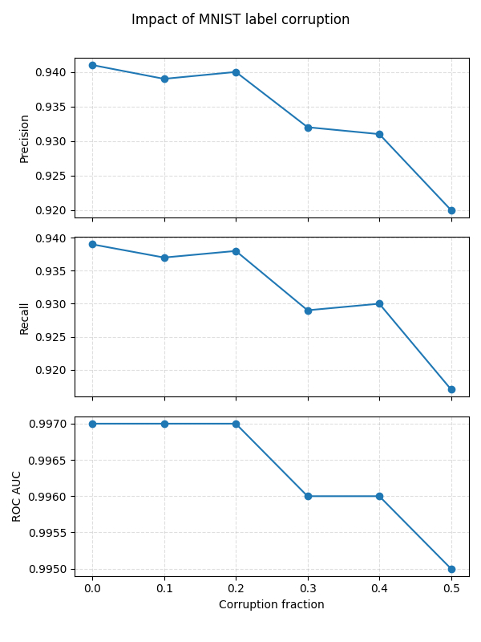

## Minimal PyTorch MNIST Example

This project shows a compact end-to-end MNIST classifier and shows that CrossEntropyLoss is robust to such kind of corruption of labels.
### Snapshot



### Prerequisites

- Python 3.12 (handled automatically by `uv` if missing)
- `uv` CLI (`pip install uv` or see <https://github.com/astral-sh/uv>)
- CUDA 12.1 capable drivers if you want GPU acceleration (CPU works too)

### Setup

```bash
# stay inside the repo root
export UV_CACHE_DIR=.uv-cache             # keeps caches writable inside the repo
export UV_TORCH_BACKEND=cu121             # pick thispreferred backend (cpu, cu121, rocm*, …)
uv sync                                   # creates .venv and installs torch/vision with the backend above
```

### Run training

```bash
UV_CACHE_DIR=.uv-cache uv run python main.py --epochs 5 --batch-size 128
```

Flags:

- `--epochs`: number of training passes (default 5)
- `--batch-size`: mini-batch size (default 128)
- `--lr`: learning rate (default 1e-3)
- `--data-dir`: where MNIST will be cached or searched (`data` by default). If thismachine cannot reach the official mirrors, download the MNIST gzip files separately and drop them into this folder following the standard filenames.

The script auto-detects CUDA and will use GPU if available.

### Corrupted-label experiment

```bash
UV_CACHE_DIR=.uv-cache uv run python main_corrupted.py --epochs 5 --corrupt-frac 0.15
```

This variant replaces 15 % of every class with samples drawn from other classes (without duplicating any images). Set `--corrupt-frac 0` to run the exact same code path without corruption for an apples-to-apples comparison. After training it prints macro precision, recall, and ROC-AUC to illustrate how the corruption impacts downstream quality.

### Automated sweeps and plots

```bash
# run main_corrupted.py for fractions 0.00, 0.10, …, 0.90 and save CSV
UV_CACHE_DIR=.uv-cache uv run python sweep_corruption.py --epochs 2 --step 0.1 --output corruption_results.csv

# plot precision/recall/ROC-AUC vs corruption level, producing corruption_metrics.png
UV_CACHE_DIR=.uv-cache uv run python plot_metrics.py --input corruption_results.csv --output corruption_metrics.png
```

`sweep_corruption.py` accepts custom `--fractions` lists if you want specific values (e.g., `--fractions 0 0.05 0.15 0.9`). `plot_metrics.py` expects the CSV schema emitted by the sweep script and stacks three subplots (precision/recall/ROC-AUC) into one image.

### Sample sweep output

Using the included `tmp_results.csv` (single-epoch runs at corruption levels 0.0→0.5), the model barely budges: accuracy stays between 91.8 % and 94.0 % and macro precision/recall remain clustered near 0.93. The plot below (`tmp_metrics.png`) makes that stability obvious—three curves are nearly flat despite injecting up to 50 % label noise.


## Notation 

* (X): input image (MNIST 28×28 tensor). In code: what the dataloader feeds to the model. 
* (Y\in{0,\dots,K-1}): **clean** (true) class label (here (K=10)).
* (\tilde Y): **observed training** label after corruption; test labels remain clean. 
* (f\in[0,0.9]): corruption rate (“fraction” in thissweep). 
* (p_j(x)=\Pr(Y=j\mid X=x)): clean class‑posterior.
* (q_j(x)=\Pr(\tilde Y=j\mid X=x)): noisy (training) class‑posterior.
* (T\in\mathbb{R}^{K\times K}): noise transition with (T_{j,y}=\Pr(\tilde Y=j\mid Y=y)) (diag (1-f), off‑diag (f/(K-1))).
* (h(x)\in\Delta^{K-1}): model’s predicted probabilities (softmax of logits) used by `CrossEntropyLoss`. 
* (c=\dfrac{f}{K-1}) and (\alpha=1-\dfrac{fK}{K-1}) (defined where first used below).

---


**1) How labels are generated in training vs. test.**
Corruption is *symmetric without self‑loops*:
[
\Pr(\tilde Y=j\mid Y=y,X=x)=
\begin{cases}
1-f,& j=y,\
\dfrac{f}{K-1},& j\neq y.
\end{cases}
]
This channel is applied only to the **training** split (to rewrite `dataset.targets`); the **test** split is loaded clean and never corrupted. 

**2) From that channel to the training target (q).**
By marginalizing over (Y),
[
q_j(x)\equiv \Pr(\tilde Y=j\mid X=x)
= \underbrace{\tfrac{f}{K-1}}*{c};+;\underbrace{\Bigl(1-\tfrac{fK}{K-1}\Bigr)}*{\alpha},p_j(x).
]
Here **(\alpha)** denotes (1-\dfrac{fK}{K-1}) and **(c)** denotes (\dfrac{f}{K-1}). So (q(\cdot\mid x)) is an **affine transform** of (p(\cdot\mid x)): same offset (c) for all classes, same slope (\alpha).

**3) What the optimizer actually fits.**
We train with cross‑entropy on ((X,\tilde Y)):
[
\mathcal{L}(h)=\mathbb{E}\big[-\log h_{\tilde Y}(X)\big].
]
Conditioned on (X=x),
[
\mathbb{E}!\left[-\log h_{\tilde Y}(x)\mid X=x\right]
=H!\big(q(x)\big)+\mathrm{KL}!\big(q(x),|,h(x)\big),
]
minimized **iff** (h(x)=q(x)). Thus the network learns (q(\cdot\mid x)), not (p(\cdot\mid x)). In the code, `CrossEntropyLoss` with the corrupted training labels implements exactly this, and evaluation uses the **clean** test labels.  The sweep script just repeats this over fractions (f). 

**4) Why the affine form is crucial.**

* **Same decisions as long as (\alpha>0).**
  For any classes (i,k),
  [
  q_i(x)-q_k(x)=\alpha,[p_i(x)-p_k(x)].
  ]
  With (\alpha>0) (i.e., (f<\tfrac{K-1}{K})), the argmax over (q) equals the argmax over (p). So the **Bayes classifier** is unchanged by this noise. That explains why accuracy stays high even at (f=0.8): the decision rule is preserved; only the signal is weaker.

* **Noisy 0–1 risk is an affine transform of clean risk.**
  For a classifier (g),
  [
  R_f(g)\coloneqq\Pr(g(X)\neq \tilde Y)=f+\alpha,\Pr(g(X)\neq Y)=f+\alpha,R_0(g).
  ]
  Minimizers coincide whenever (\alpha>0). Same boundary, different scale.

* **Ranking metrics are preserved in principle.**
  One‑vs‑rest scores use (q_j(x)=c+\alpha p_j(x)). Positive affine transforms preserve rankings, so ROC‑AUC is (population‑wise) unaffected; thisobserved AUC degradation before the cliff is finite‑sample/optimization error.

* **Identifiability and the “0.9 cliff.”**
  The mapping (q=T,p) has eigenvalues (1) (uniform direction) and (\alpha) (multiplicity (K{-}1)).

  * If (\alpha\neq0) ((f\neq\tfrac{K-1}{K})), (T) is invertible; you can, in principle, recover (p) from (q) or apply loss‑correction using (T).
  * At (\alpha=0) (here (f=\tfrac{K-1}{K}=0.9)), (q(x)\equiv\frac{1}{K}) for all (x): labels carry **no information** about images, so learning collapses—exactly the drop we can see at (f=0.9). this code allows up to (0.9) in the sweep, which reveals this boundary. 

**5) Why performance drops *before* the cliff.**
As (f\uparrow\tfrac{K-1}{K}), **(\alpha)** shrinks to 0, compressing margins (q_i-q_k). With finite data and imperfect optimization, smaller margins mean harder estimation, hence gradual loss of accuracy/AUC even though the *population* decision rule is unchanged.

---

## Where this appears in this code

* Corruption of **training** labels only (`corrupt_training_set`); **test** labels remain clean. 
* Training with `nn.CrossEntropyLoss()` fits (h\approx q); evaluation uses clean test labels and model softmax for accuracy/precision/recall/ROC‑AUC. 
* `sweep_corruption.py` runs multiple (f) values and logs the clean‑test metrics you reported. 

**Takeaway.** The corruption makes the training target (q) an affine image of the clean posterior (p). Because the slope **(\alpha)** is positive up to (f=\tfrac{K-1}{K}), decisions (argmax) are theoretically unchanged, rankings are preserved, and only calibration/margins degrade—until (\alpha=0) (this0.9 “cliff”), where information vanishes.


